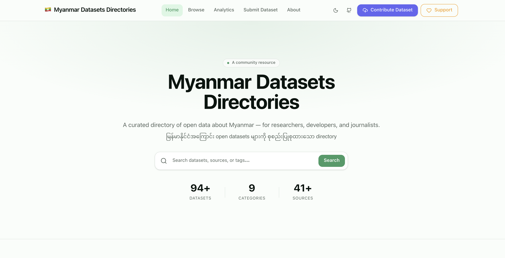

<!-- COVER IMAGE — replace the placeholder below with your actual banner/screenshot -->

# Myanmar Dataset Directories

A curated open directory of datasets about Myanmar, covering language, humanitarian, geospatial, economic, health, agriculture, transport, media, and education domains.

---

# Technical report 

- [Vibecoding Myanmar Datasets Directories Website 
 ](https://www.researchgate.net/publication/406294766_Vibecoding_Myanmar_Datasets_Directories_Website)

## 📁 Dataset Collection

| Category | Datasets |
|----------|---------|
| 🗣 NLP & Language | 37 |
| 🏥 Humanitarian | 30 |
| 📊 Economic | 9 |
| 📰 Media | 8 |
| 🗺 Geospatial | 3 |
| 🎓 Education | 3 |
| 💊 Health | 2 |
| 🌾 Agriculture | 2 |
| 🚌 Transport | 2 |
| **Total** | **94** |

---

## 👥 Contributors

- [Pyae Sone Phyo ](https://github.com/delulusientist)

## UI Demo

Watch a short demonstration of the Myanmar Dataset Directories platform:

https://youtu.be/YKbJBumj7oA?si=E5AORCgH9LFB4ZkZ

---

## 🙏 Acknowledgements

Datasets in this directory are sourced from and made possible by the following organizations and communities:

- [HDX / OCHA](https://data.humdata.org) — Humanitarian data platform
- [Myanmar Information Management Unit (MIMU)](https://themimu.info) — Geospatial and admin boundary data
- [HuggingFace](https://huggingface.co) — NLP and language datasets
- [World Bank Open Data](https://data.worldbank.org) — Economic and development indicators
- [FAO / WFP](https://www.fao.org) — Agriculture and food security data
- [NASA FIRMS](https://firms.modaps.eosdis.nasa.gov) — Active fire and environmental data
- [IFPRI](https://myanmar.ifpri.info) — Household and agricultural surveys
- [OpenStreetMap / Geofabrik](https://download.geofabrik.de) — Geospatial extracts
- The Myanmar NLP and open data community

---

## 📬 Contact

Have a dataset to suggest, a correction to report, or want to collaborate?

- Email: — deluschientist@gmail.com 

